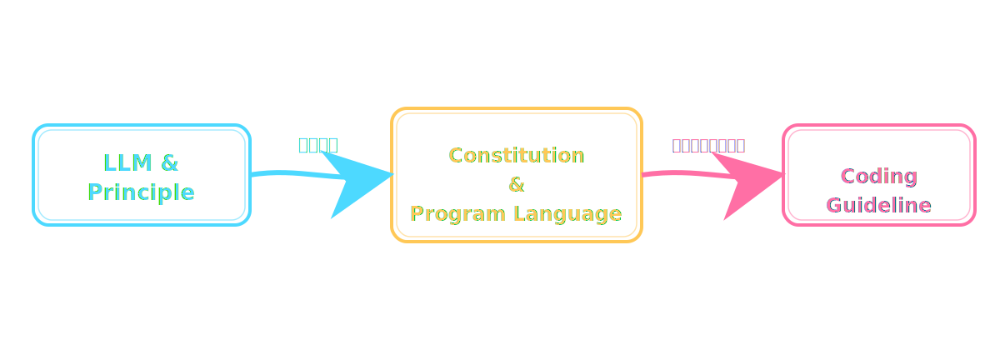
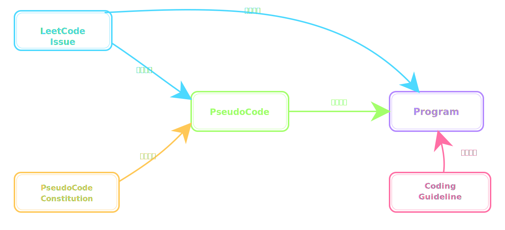

# LeetCode 軟體開發代理人

本專案是一個人工智慧代理人，用於撰寫 LeetCode 題目。

## 簡介

本專案是基於此前研究項目為基礎，並建構規格驅動開發的設計概念，設計一系列適用 Claude 的技能。

+ [提示詞工程研究](https://github.com/eastmoon/tutorial-llm-prompt)
+ [規格驅動開發研究](https://github.com/eastmoon/research-spec-driven-development)

其技能設計目的如下：

+ 基於規格文件生成程式碼
+ 基於程式碼解讀成規格文件

這項設計是考量如何運用大語言模型的分析、評估、生成能力，進而對大型軟體重構與最小有價值程式開發。

為驗證其技能可如預期執行，本專案以 LeetCode 題目為驗證範本，並提供相關技能。

## 技能

+ 憲章
  - ```/codekit-software-design-constitution```，軟體開發憲章，提供軟體開發的設計原則。
  - ```/codekit-coding-pseudocode-constitution```，虛擬碼設計憲章，提供虛擬碼的撰寫原則。
  - ```/codekit-coding-guideline-constitution```，程式指南憲章，提供程式語言的撰寫原則。
+ 指南
  - ```/codekit-coding-guideline C++```，生成 C++ 程式語言的設計指南。
  - ```/codekit-coding-guideline C#```，生成 C++ 程式語言的設計指南。
  - ```/codekit-coding-guideline JavaScript```，生成 C++ 程式語言的設計指南。
  - ```/codekit-coding-guideline Python```，生成 C++ 程式語言的設計指南。
  - ```/codekit-coding-guideline Rails```，生成 Ruby on Rails 程式語言的設計指南。
+ LeetCode 操作
  - ```/leetcode-generate 1```，取得 LeetCode 編號 1 題目。
  - ```/leetcode-generate Two-Sum```，取得 LeetCode 名稱為 Two-Sum 題目。
  - ```/leetcode-pseudo 1```，生成編號 1 題目的 PseudoCode。
  - ```/leetcode-coding 使用 C++ 撰寫問題編號 1```，基於描述生成程式碼。

## 原理

### 憲章與指南

基於規格驅動開發的設計概念，以及諸多提示詞工程相關文獻，若要大語言模型穩定的內容，則需要先制定憲章，進而確立後續運用的條目與檢核項；如此設計有其優勢：

1. 藉由大語言模型生成其可理解的繁瑣條目與內容
2. 分階段執行，固化已經確認的內容，避免每次執行解釋原則導致的不穩定內容

套用此觀念，則可基於憲章產生不同程式語言的撰寫指南，其執行關係如下圖：



### 虛擬碼與程式碼

一個需求題目在程式設計師腦中轉換成程式，每個人方法皆有不同，單就個人習慣而言，會將細部邏輯陳述為虛擬碼 ( 或程式中的註解 )，在從虛擬碼轉換成程式碼。



也就如上圖所示，對 LeetCode 解題流程如下：

1. 自公開資訊取得題目，生成題目檔案於 [issue](./issue) 目錄
2. 基於題目解釋邏輯，生成虛擬碼於題目目錄中，例如問題 1 的 [0001_Two-Sum](./app/0001_Two-Sum) 目錄
3. 基於題目、虛擬碼、程式語言設計指南 ( e.g Python )，生成程式碼 ( e.g main.py ) 與測試碼 ( e.g test.py ) 於題目目錄中，例如問題 1 的 [0001_Two-Sum](./app/0001_Two-Sum) 目錄

需要補充，本項目將程式碼設計於單一類別中並統一採用 exec 函數執行，而用於驗證的程式則於測試碼中。
